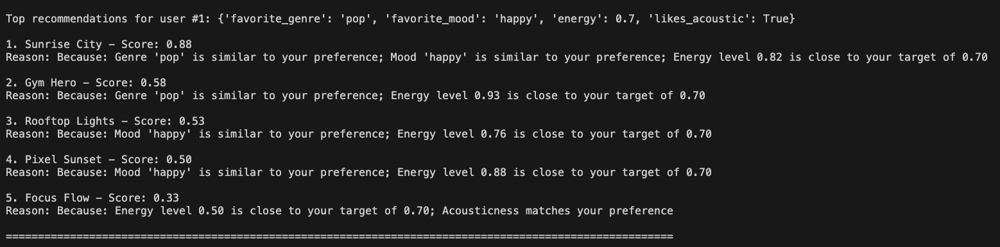
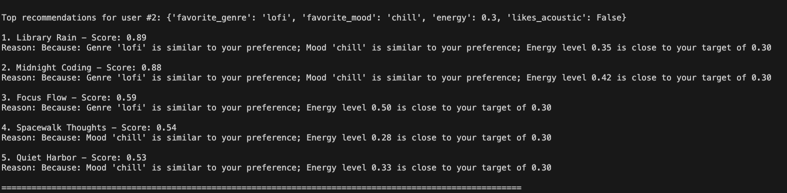
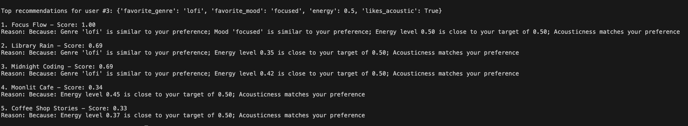

## Video Demo (Loom)
link: https://www.loom.com/share/c06b7f391a234aec8b02f91fb166cd38

# 🎵 Original: Music Recommender Simulation

The original project will take in some user preferences for song genre, mood, energy, and acousticness. It will then read a list of songs and rank them based on these preferences.

# 🎵 Applied AI: Music Recommender Simulation

This project takes in user preferences for song genre, mood, energy, and acousticness, then reads a list of songs and ranks them based on those preferences.

The AI addition replaces the original all-or-nothing genre and mood matching with **semantic similarity scores from the HuggingFace Inference API** (`sentence-transformers/all-MiniLM-L6-v2`). The new things it can do before making a recommendation:

- Differentiate between similar genres, for example "lofi" and "ambient", and give it a similarity score
- Do the same for mood comparison, for example "chill" and "relaxed"

The original project only had an all-or-nothing approach to scoring the mood and genre.
This addition allows the recommender to make more accurate and realistic recommendations.

## System Diagram

The program will collect the user's preferences and load in all of the songs from the .csv file. These will be sent to the recommender which will then use the preferences and song list to compare and score each song. These songs will then get ranked based on the final score they recieved.

## Setup Requirements

1. Create virtual environment (Optional):
```bash
python -m venv .venv
source .venv/bin/activate
```

2. Install dependencies:
```bash
pip install -r requirements.txt
```

3. Run the app:
```bash
python src/main.py
```

## Sample interactions

I tested the output with 3 different users with different preferences. These were their preferences and the output from the program:

User 1. "favorite_genre": "pop", "favorite_mood": "happy", "energy": 0.7, "likes_acoustic": True


1. Sunrise City - Score: 0.88
Reason: Because: Genre 'pop' is similar to your preference; Mood 'happy' is similar to your preference; Energy level 0.82 is close to your target of 0.70

2. Gym Hero - Score: 0.58
Reason: Because: Genre 'pop' is similar to your preference; Energy level 0.93 is close to your target of 0.70

3. Rooftop Lights - Score: 0.53
Reason: Because: Mood 'happy' is similar to your preference; Energy level 0.76 is close to your target of 0.70

4. Pixel Sunset - Score: 0.50
Reason: Because: Mood 'happy' is similar to your preference; Energy level 0.88 is close to your target of 0.70

5. Focus Flow - Score: 0.33
Reason: Because: Energy level 0.50 is close to your target of 0.70; Acousticness matches your preference

User #2. "favorite_genre": "lofi", "favorite_mood": "chill", "energy": 0.3, "likes_acoustic": False


1. Library Rain - Score: 0.89
Reason: Because: Genre 'lofi' is similar to your preference; Mood 'chill' is similar to your preference; Energy level 0.35 is close to your target of 0.30

2. Midnight Coding - Score: 0.88
Reason: Because: Genre 'lofi' is similar to your preference; Mood 'chill' is similar to your preference; Energy level 0.42 is close to your target of 0.30

3. Focus Flow - Score: 0.59
Reason: Because: Genre 'lofi' is similar to your preference; Energy level 0.50 is close to your target of 0.30

4. Spacewalk Thoughts - Score: 0.54
Reason: Because: Mood 'chill' is similar to your preference; Energy level 0.28 is close to your target of 0.30

5. Quiet Harbor - Score: 0.53
Reason: Because: Mood 'chill' is similar to your preference; Energy level 0.33 is close to your target of 0.30

User #3: "favorite_genre": "lofi", "favorite_mood": "focused", "energy": 0.5, "likes_acoustic": True


1. Focus Flow - Score: 1.00
Reason: Because: Genre 'lofi' is similar to your preference; Mood 'focused' is similar to your preference; Energy level 0.50 is close to your target of 0.50; Acousticness matches your preference

2. Library Rain - Score: 0.69
Reason: Because: Genre 'lofi' is similar to your preference; Energy level 0.35 is close to your target of 0.50; Acousticness matches your preference

3. Midnight Coding - Score: 0.69
Reason: Because: Genre 'lofi' is similar to your preference; Energy level 0.42 is close to your target of 0.50; Acousticness matches your preference

4. Moonlit Cafe - Score: 0.34
Reason: Because: Energy level 0.45 is close to your target of 0.50; Acousticness matches your preference

5. Coffee Shop Stories - Score: 0.33
Reason: Because: Energy level 0.37 is close to your target of 0.50; Acousticness matches your preference

These outputs match the users preferences and making the recommendations very accurate.

## Design Decisions

At first I wanted to make an API call using the Gemini API, but the free tier had a quota limit of 0 for my account. I then tried `sentence_transformers` (a local ML model) but it took over 10 minutes to load due to its size. The final solution uses the HuggingFace Inference API to run `sentence-transformers/all-MiniLM-L6-v2` remotely — no local model loading, and similarity scores are cached to disk so repeat runs don't re-call the API.

## Testing Summary

The Gemini API calls did not work due to quota limitations. The `sentence_transformers` library was too slow to load locally. Tests were written to verify that similar genres and moods score higher than unrelated ones using the embedding-based similarity.

Before the recommender would only give points if the genre matching was a perfect match. Now genres and moods are scored using real semantic embeddings — two labels that are conceptually similar (like "lofi" and "ambient") will receive a high similarity score even if they are not identical.

## Reflection

AI was helpful with the implementation of a better scoring system for the recommender. It was able to help me try out and decide on what the best approach would be. In the end I went with the HuggingFace Inference API, which provides real semantic similarity scores from a pre-trained model without requiring a local install. 

One error that the AI made was trying to access the value in the user preferences dictionary by the wrong key. This meant that nothing was being returned and the genre wasn't being considered. 